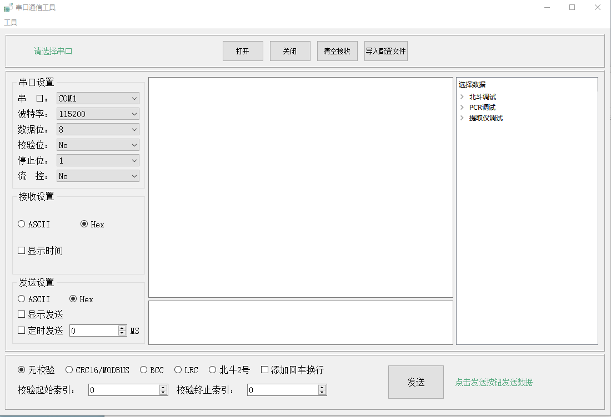

**该程序是一款可以定制指令的串口调试工具**

软件界面如图1所示



<center>图1 软件界面</center>

# 功能介绍

## 接收消息

选择好串口参数后点击打开按钮打开串口。接收数据有两种显示方式，分别是ASCII和HEX方式，另外可以根据需要在接收到到的数据前方加上数据到达的时间，只需勾选上 [ ]显示时间复选框即可。

## 发送消息

发送消息时可以根据情况选择以ASCII码发送还是以HEX（十六进制）方式发送，若以HEX形式发送，数据之间必须是以空格隔开，否则程序无法识别数据。

当[]显示发送复选框被选中时，数据发送成功后会在数据接收框中显示发送的完整数据。

当[]定时发送复选框被选中时，点击发送按钮后会在指定的时间间隔内定时发送相同的数据，数据以发送框中的数据为准。

## 数据校验

程序提供了4种校验方式，分别是：

- CRC16/MODBUS:	采用CRC16/MODBUS校验方式，计算结果拆分成两个字节添加到数据末尾，高8位在前，低8位在后。
- BCC: 采用BCC校验方式，计算得到一个字节的校验码，并填充到数据末尾。
- LRC: 采用LRC校验方式，计算得到一个字节的校验码，并填充到数据末尾。
- 北斗2号: 根据北斗2号协议计算得到校验码，并自动添加*xx到数据末尾，xx为计算的校验码。

回车换行：当[]回车换行被选中时，发送数据时会自动在数据末尾添加0x0d 0x0a内容。

##  指令配置

程序右边的指令集需要用户自己配置。在软件安装目录下找到config.json文件，通过配置该文件生成指令集。

当单击指令名称时，程序会将指令内容填充到发送框，双击指令名称时，程序会将指令内容填充到发送框，并直接将指令发送出去。

config.json配置如下

```json
[
  {
    "name": "北斗调试",		//指令集名称
    "frames": [	//指令集
      {
        "name": "TXA",	//指令名称
        "data": "$CCTXA,0922981,1,1,123456" //帧数据
      }
    ]
  }
]
```

> 注：在实际配置时，不能写注释内容，否则会导致程序解析json文件失败。


